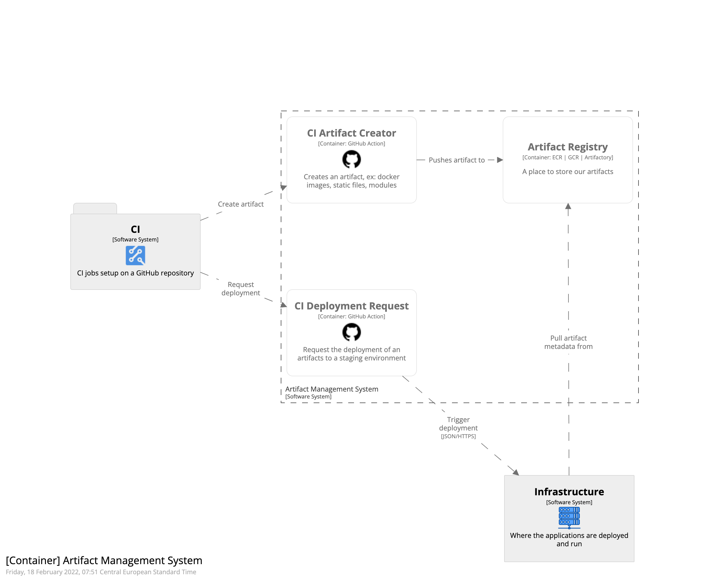

# Introduction

At [osscameroon](https://osscameroon.com) we often build software solutions that need to be deployed on different environments.
This applications are packaged in several forms such as **docker images**, **static files** or **modules**.

A packaged deployable application is called an **artifact**. Those artifacts are generated on CI jobs and developers will manually deploy them on our infrastructure.
We currently have no nice and easy way to deploy applications automatically on both our **staging** and **production** environments.

That's where **Sami** comes in. **Sami** is a system that will help us better manage the creation and deployment of our artifacts.


# Architecture

**Sami** is composed of several subsystems that handle the creation, storage and deployment of artifacts.

- A **Repository** where the code lives with **CI integrations** triggered on pull request merged.
- The **Artifact Management System** that will create, store and request a deployment of your artifacts.
- The **Infrastructure** your application runs on.


*Artifact Managment System*

## Repository

Where your application code lives. At [osscameroon](https://osscameroon.com) we store our source code on **GitHub**.
This repository contains `CI` workflows that interacts with the **Artifact Managment System**.

## Artifact Managment System

The **Artifact Managment System** is responsible for the creation, storage of your artifacts,
 this is also where we can request the deployment of an artifact to any environment.

In the case of an application packaged as a **docker image**,
 the application repository will contain several **CI workflows** that will be triggered
 when a pull request gets merged into the `master/main` branch.

- **CI Artifact creation** workflow creates a docker image and pushes it to a **docker container registry**.
- **CI Artifact deployment** request a deployment of the newly created docker image in our infrastructure.



*Artifact Managment  System Containers*

### CI Artifact creation
The Artifact creation CI is a reusable [GitHub Action](https://github.com/features/actions) that creates your artifacts, tags it and pushes it to an Artifact Registry.
For a docker image that action will create the image and push it either on the [GitHub Container Registry](https://docs.github.com/en/packages/working-with-a-github-packages-registry/working-with-the-container-registry) or to [DockerHub](https://hub.docker.com/)

*Note: we have  built an Artifact Creation workflow [here](https://github.com/osscameroon/camerdevs/blob/682256603a8bd3cb58752a66e81ce36b37a1e6d6/.github/workflows/backend-build-api-image.yaml#L41)*

### Artifact Registry
An artifact registry designate the place your artifacts are being stored. For docker images it can be a container registry and for static files can be an s3 bucket.


### CI Artifact deployment request
This CI integration is a reusable [GitHub Action](https://github.com/features/actions) to request for your application artifact to be deployed on a specific environment.

*Note: we have built an Artifact Deployment workflow [here](https://github.com/osscameroon/camerdevs/blob/682256603a8bd3cb58752a66e81ce36b37a1e6d6/.github/workflows/backend-build-api-image.yaml#L49)*

## Infrastructure

The application you build and package need to run on an infrastructure. The infrasture is a set of several components that allow us deploy, run, monitor and observe our applications/services.

The infrastructure consists of these components:

- A Git repository containing your applications deployment manifests.
- An instance of [Webhook](https://github.com/adnanh/webhook).
- A [Swarm](https://docs.docker.com/engine/swarm/) cluster which is where application will be run and scheduled.

.png)
*Infrastructure*

### GitHub Repository
Your applications deployment manifests should live in a GitHub repository.
This repository also contains few **CI workflows** that will update your artifact sha in the manifest
and/or trigger an api call to the **Webhook** that will trigger the actual deployment on your swarm clusters.

**Examples:**
- CI Updating the artifact sha in your manifest can found [here](https://github.com/osscameroon/deployments/blob/main/.github/workflows/deploy-service.yaml)
- CI making the api call to the webhook can be found [here](https://github.com/osscameroon/deployments/blob/main/.github/workflows/apply-config.yaml)

#### Deployment folder structure
The deployment folder should follow a very strict structure and contain a `sami.yaml` file
that describe your service's deployment.

##### Folder

At the root of the [deployments folder](https://github.com/osscameroon/deployments)


###### L0 - root

You can find these folder:

- `conf` folder container configuration for applications running on the VPS such as `nginx`.
- `services` which contains a list of services.
Each service folder name should match the name of your service otherwise the `sami-cli` won't be able to pick them up correctly.
- `README.md` that should contain a description of the deployments folder.


###### L1 - service_name
Inside the `services/<service_name>/` folder are contained folders named after the type of deployment you want to perform
The supported type of deployment can be `swarm`, `compose`, `k8s`, `cron`, `static_file` etc...

###### L2 - deployment_type
The `services/<service_name>/<deployment_type>/` folder contain a folder named
after the environment you want your application to be deployed to.
The supported environment are `stage`, `production`, `pull_request`.

###### L3 - environment
In the `service/<service_name>/<deployment_type>/<environment>` can be found
a `sami.(yaml|yml)` file that describes the service we would like to deploy.

###### Tree
```
├── README.md
├── conf
│   └── nginx
│       └── sites-enabled
│           ├── camerdevs.com
│           ├── grafana.osscameroon.com
│           ├── portainer.osscameroon.com
│           └── webhooks.osscameroon.com
└── services
    ├── camerdevs
    │   └── compose
    │       ├── prod
    │       └── stage
    │           └── camerdevs-stack.yml
    ├── caparledev-bot
    │   └── compose
    │       └── stage
    │           └── caparledev-bot-stack.yml
    ├── portainer
    │   └── compose
    │       └── prod
    │           └── portainer-agent-stack.yml
    └── prometheus
        └── compose
            └── prod
                ├── grafana
                ├── prometheus
                └── prometheus-stack.yml
```

##### Sami's file

the `sami.(yaml|yml)` file describes the service we want to deploy.
The file is picked up and used by the `sami-cli` in order the deploy the application on our infrastructure.

*Manifest*
```yaml
#service/<service_name>/<deployment_type>/<environment>/sami.(yml|yaml)
version: v1beta

service_name: "camerdevs"
type: "swarm"

#This description is not exhaustive and will be enriched as we design
#the system
```


### Webhook

The [webhook](https://github.com/adnanh/webhook) is a peice of software that runs on your swarm manager node, usually your VPS and is listening for https requests.
This webhook will receive endpoint https **POST** or **GET** request on the `/deployment_request` endpoint
and deploy your application on the cluster using the `sami-cli`.


### Swarm

[Swarm](https://docs.docker.com/engine/swarm/) is our scheduler, we choose to use it because it runs well on low resources VPS.
Which makes it very good for developers or teams without too much resources.
We deploy a series of services on our swarm clusters for observability and monitoring.
- Portainer
- Prometheus
- Grafana

But also [Traefik](https://traefik.io/) a reverse proxy that will proxy our requests to the services running on swarm.
